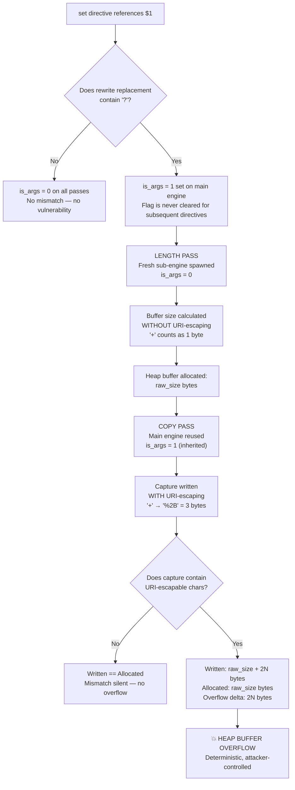
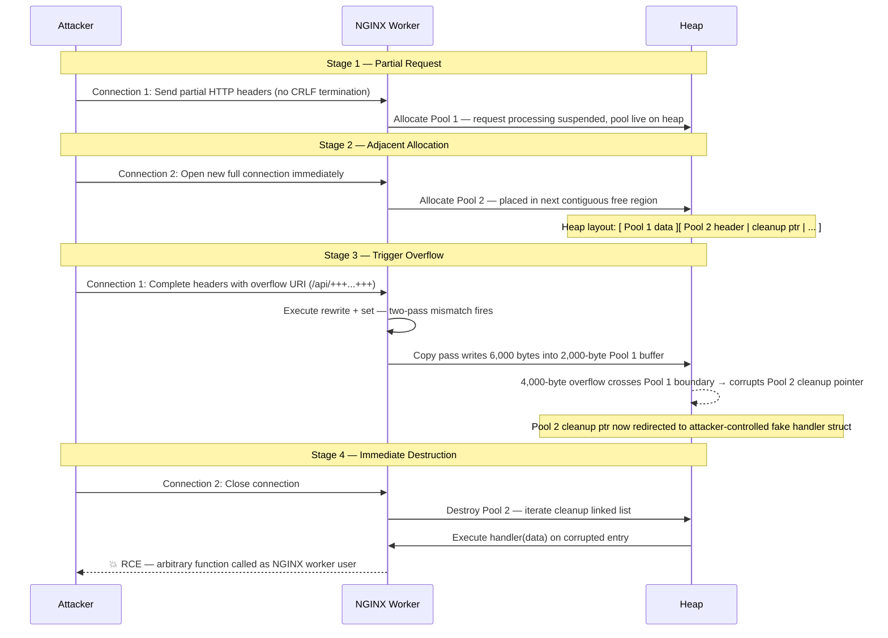

## Overview

NGINX Rift is a critical heap buffer overflow vulnerability located in the `ngx_http_rewrite_module`.
It allows an unauthenticated remote attacker to crash a worker process or, under favorable memory
conditions, achieve Remote Code Execution (RCE).

This bug existed in the NGINX codebase since 2008 and was disclosed on **May 13, 2026**, by
**depthfirst**, alongside three other memory corruption issues.

| Property | Value |
| :--- | :--- |
| **CVE ID** | CVE-2026-42945 |
| **CVSS v4 Base Score** | 9.2 (Critical) |
| **Affected Component** | `ngx_http_rewrite_module` |
| **Attack Vector** | Unauthenticated, Remote |
| **Disclosure Date** | May 13, 2026 |
| **Public PoC** | [DepthFirstDisclosures/Nginx-Rift](https://github.com/DepthFirstDisclosures/Nginx-Rift) |

## Trigger Conditions

The vulnerability is **not reachable on every NGINX installation**. It requires a specific
configuration pattern to be present simultaneously:

1. A `rewrite` directive using an unnamed PCRE capture group (e.g., `$1`, `$2`).
2. A replacement string containing a question mark (`?`).
3. A subsequent `rewrite`, `if`, or `set` directive in the **same scope**.

> **Note:** Although this sounds specific, this exact pattern is extremely common in production
> deployments used for legacy URL canonicalization, API gateway routing, and path preservation
> across migrations.

## Related Vulnerabilities

Three additional vulnerabilities were disclosed alongside Rift from the same security audit:

| CVE | Subsystem | Severity | Impact |
| :--- | :--- | :--- | :--- |
| **CVE-2026-42945 (Rift)** | `ngx_http_rewrite_module` | 9.2 Critical | Heap overflow, RCE |
| **CVE-2026-42946** | `ngx_http_scgi_module`, `ngx_http_uwsgi_module` | 8.3 High | Heap overread on crafted upstream response; worker memory disclosure or DoS |
| **CVE-2026-40701** | `ngx_http_ssl_module` | 6.3 Medium | Use-after-free on OCSP DNS path |
| **CVE-2026-42934** | `ngx_http_charset_module` | 6.3 Medium | Out-of-bounds read on UTF-8 boundary |

---

## The Core Directives: `rewrite` and `set`

CVE-2026-42945 centers around two common, well-documented NGINX directives. Understanding their
individual behavior and their standard combined use is key to understanding the root cause.

### The `rewrite` Directive

The `rewrite` directive modifies the incoming request URI based on a regular expression match.
When a match is found, NGINX replaces the URI with a new string.

```nginx
location ~ ^/api/(.*)$ {            
    rewrite ^/api/(.*)$ /v2/api/$1; 
}
```

In this example, a request to `/api/users/42` is internally rewritten to `/v2/api/users/42`.

> **Key Behavior:** If the replacement string contains a question mark (`?`), NGINX treats
> everything after it as a new query string and **completely discards** the original request's
> query arguments. This is the documented mechanism for dropping or rewriting query parameters
> during URL canonicalization — and the precise condition that arms the bug.

### The `set` Directive

The `set` directive assigns a value to a custom variable that persists for the lifetime of the
current request. The value can be a constant, another variable, or a regex back-reference (e.g.,
`$1`) from the most recently evaluated expression.

Administrators commonly use `set` to preserve information that would otherwise be lost after a
rewrite, or to build values for proxy headers, logging, or downstream routing decisions.

### The Common Chain

It is standard practice to chain these two directives together to preserve capture data across
a rewrite:

```nginx
location ~ ^/api/(.*)$ {              
    rewrite ^/api/(.*)$ /v2/api/$1;   
    set $original_endpoint $1;        
}
```

This sequence is explicitly supported and documented by NGINX, making it a trusted pattern in
countless production configurations — which is precisely what makes it a high-value attack surface.

---

## Root Cause: The Two-Pass Mismatch

The vulnerability stems from a flaw in how the NGINX script engine handles regex captures when a
`rewrite` directive containing `?` is followed by a `set` directive. The root cause is a single
internal flag named `is_args` that is set during one processing pass but incorrectly inherited
during another.

### The Role of the `is_args` Flag

The `is_args` flag signals to the engine that it is currently writing to the **query-string
portion** of a URL. This controls whether captured values should be URI-escaped before being
written to the output buffer.

### How the Mismatch Happens

When a `rewrite` replacement string contains a `?`, NGINX sets `is_args = 1` on the **main script
engine**. This flag is **never explicitly reset** before subsequent directives execute.

When the following `set` directive references a regex capture, it executes a **two-pass** operation:

| Pass | Engine Used | `is_args` State | Behavior |
| :--- | :--- | :--- | :--- |
| **Length Pass** | Fresh, zeroed sub-engine | `0` (default) | Calculates required buffer size **without** URI-escaping |
| **Copy Pass** | Main engine (inherited state) | `1` (set by rewrite) | Writes capture data **with** URI-escaping |

### The Resulting Buffer Overflow

For characters that do not require escaping, both passes produce the same byte count and the
mismatch is harmless. However, for URI-escapable characters (e.g., `+` → `%2B`), a critical
size divergence occurs:

- The **Length Pass** allocates a buffer sized for the raw, un-escaped input (1 byte per `+`).
- The **Copy Pass** writes the URI-escaped output (3 bytes per `+` as `%2B`).

If the captured substring contains `N` escapable characters, the copy pass writes
`raw_size + (2 × N)` bytes into a buffer allocated for only `raw_size` bytes —
a **deterministic, attacker-controlled heap buffer overflow**.

### Two-Pass Mismatch: Flowchart



### Trigger Configuration

The following minimal configuration is sufficient to expose the vulnerability:

```nginx
location ~ ^/api/(.*)$ {                         # Regex block — $1 captures everything after /api/
    rewrite ^/api/(.*)$ /internal?migrated=true;  # '?' sets is_args=1 on the main engine; never reset
    set $original_endpoint $1;                    # VULNERABLE: $1 reference triggers two-pass mismatch
}
```

### Exploit Example

An attacker sends a request containing a long sequence of URI-escapable characters in the
captured path segment:

```http
GET /api/++++++++++++++++++++++++++++++++++++++++++++ HTTP/1.1
Host: localhost

# Each '+' is URI-escapable: '+' (1 byte) expands to '%2B' (3 bytes) in the copy pass.
# With 2,000 '+' characters in the captured segment:
#   Length Pass allocates : 2,000 bytes
#   Copy Pass writes      : 6,000 bytes  (2,000 chars × 3 bytes each)
#   Heap overflow         : 4,000 bytes written past the end of the allocated chunk
```

### Important Limitation

The overflow bytes are processed by `ngx_escape_uri`, which restricts output to valid URI-safe
ASCII characters. An attacker **cannot** directly inject raw binary payloads, null bytes, control
characters, or memory pointers through the overflow path alone. Constructing an exploitable
payload therefore requires the supplementary techniques described in the next section.

---

## Turning the Overflow into Remote Code Execution

A heap overflow alone does not equal code execution. To achieve RCE, an attacker must overwrite
a live function pointer on the heap that the NGINX worker process will subsequently call.

### Target: NGINX Memory Pools

NGINX allocates per-request memory using pool structures (`ngx_pool_t`). Each pool maintains a
linked list of cleanup callbacks (`ngx_pool_cleanup_t`). Every entry in this list contains:

- A **function pointer** (`handler`)
- An **argument pointer** (`data`)

When a memory pool is destroyed, NGINX walks this linked list and invokes `handler(data)` for
every entry. Controlling any entry in this list is equivalent to controlling execution.

### The Challenge: Avoiding an Early Crash

The cleanup pointer resides at **offset 64** inside the pool structure. A naive continuous
overflow will corrupt the fields *preceding* the cleanup pointer. If NGINX dereferences any of
those earlier corrupted fields during processing — before pool teardown — the worker crashes
without ever reaching the cleanup walk, eliminating the RCE window.

The attacker therefore operates under a hard constraint: corrupt **precisely** the cleanup
pointer and trigger pool destruction **immediately**, before any further pool access occurs.

### Cross-Request Heap Feng Shui

The exploit achieves the required memory layout and destruction timing through a four-stage
technique called **cross-request heap feng shui**:

1. **Partial Request** — Connection 1 sends only partial HTTP headers. NGINX allocates Pool 1
   but suspends processing, leaving the pool live and unmodified on the heap.
2. **Adjacent Allocation** — Connection 2 is opened immediately after. The allocator places
   Pool 2 in the next contiguous free region, directly adjacent to Pool 1.
3. **Trigger Overflow** — Connection 1's headers are completed with the overflow payload.
   The overflow spills out of Pool 1's buffer and corrupts Pool 2's header — specifically its
   cleanup list pointer.
4. **Immediate Destruction** — Connection 2 is closed. NGINX destroys Pool 2 at once, walks the
   now-corrupted cleanup list, and executes the attacker's chosen function — bypassing all
   earlier corrupted fields entirely because the pool is torn down before they are accessed again.

### Cross-Request Timing: Sequence Diagram



### Bypassing URI Escaping Limitations

Because all overflow bytes pass through `ngx_escape_uri`, standard 64-bit pointers (which
contain null bytes) cannot be written directly via the overflow. The exploit overcomes this
constraint through two complementary techniques:

1. **Deterministic Heap Layout** — Every NGINX worker is forked from the master process,
   inheriting an identical virtual address space. This makes heap layout fully predictable
   across worker restarts, even following attacker-induced crashes.

2. **Heap Spraying via POST Bodies** — HTTP POST request bodies are written into worker memory
   as **raw bytes**, completely bypassing URI-escaping. The attacker sends thousands of POST
   requests containing fake `ngx_pool_cleanup_t` structures populated with real binary function
   pointers (e.g., `system()`), saturating the heap with controlled data.

By iterating over heap-offset candidates and leveraging single-byte low-address overwrites, the
exploit eventually redirects a cleanup pointer into one of the sprayed fake structures. The
deterministic layout and automatic worker respawning make this brute-force search converge
reliably within minutes.

### ASLR and Denial of Service Considerations

| Scenario | Outcome |
| :--- | :--- |
| **ASLR disabled** | Full RCE — published PoC demonstrates code execution via deterministic pointer layout |
| **ASLR enabled** | RCE not demonstrated by published PoC — sprayed pointers become unpredictable |
| **ASLR enabled (any config)** | Reliable Denial of Service — every matching request corrupts the heap and crashes the worker |

> **Note:** Even without a working ASLR bypass, a simple request loop against a vulnerable
> configuration is sufficient to force NGINX into a continuous crash-respawn cycle, effectively
> taking the server offline for the duration of the attack.

---

## Exploitation: Running the Proof of Concept

The exploit driver (`poc.py`) exposes two mutually exclusive operating modes for real-world use.

### Mode 1: Single Command Execution

The `--cmd` flag executes a single shell command through the hijacked `system()` cleanup handler
and exits. This mode is used to prove remote code execution by planting a side-channel artifact
on the target filesystem.

```bash
# Execute a single command on the target: write a marker file to /tmp/pwned
python3 poc.py --cmd 'echo hello from asbawy > /tmp/asbawy'
```

Once the PoC reports success, verify execution on the target:

```bash
cat /tmp/asbawy
# Expected output: hello from asbawy
#
# The file is owned by the NGINX worker user.
# In misconfigured deployments where the worker runs as root, this yields a root-owned artifact.
```

### Mode 2: Interactive Reverse Shell

The `--shell` mode targets post-exploitation access. It auto-generates a Python reverse shell
payload, starts a local `netcat` listener, and runs the exploit loop against the target.

```bash
# Launch the exploit in reverse shell mode
python3 poc.py --shell
```

---

## References

| Reference | Detail |
| :--- | :--- |
| **CVE-2026-42945** | NGINX Rift — Heap buffer overflow in `ngx_http_rewrite_module` — CVSS v4: **9.2 Critical** |
| **CVE-2026-42946** | Heap overread in `ngx_http_scgi_module` / `ngx_http_uwsgi_module` — CVSS v4: **8.3 High** |
| **CVE-2026-40701** | Use-after-free in `ngx_http_ssl_module` (OCSP DNS path) — CVSS v4: **6.3 Medium** |
| **CVE-2026-42934** | Out-of-bounds read in `ngx_http_charset_module` (UTF-8 boundary) — CVSS v4: **6.3 Medium** |
| **Public PoC Repository** | [https://github.com/DepthFirstDisclosures/Nginx-Rift](https://github.com/DepthFirstDisclosures/Nginx-Rift) |
| **Disclosure Date** | May 13, 2026 |
| **Disclosed By** | depthfirst (DepthFirstDisclosures) |
| **Affected Component** | NGINX `ngx_http_rewrite_module` — all versions tracing back to 2008 introduction |
  